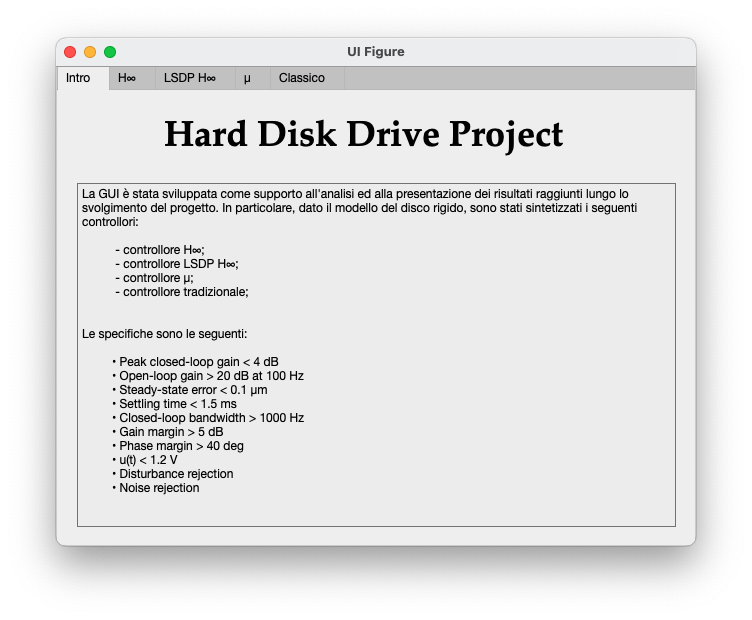
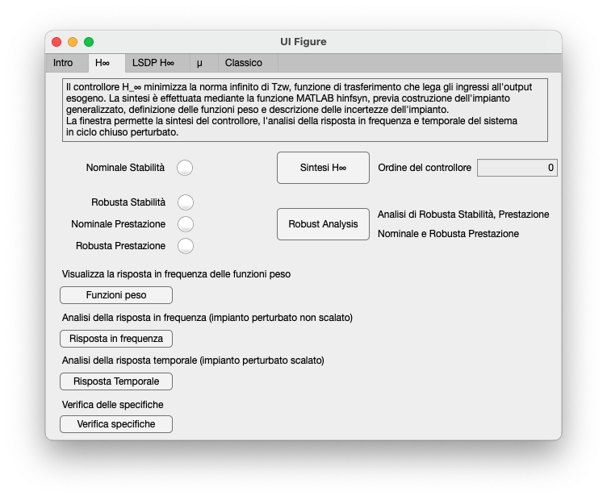
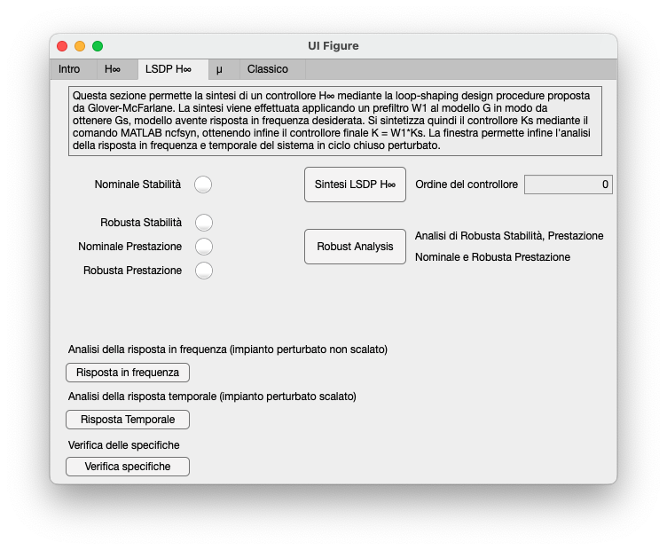
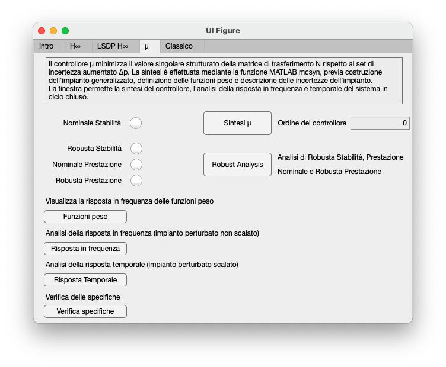
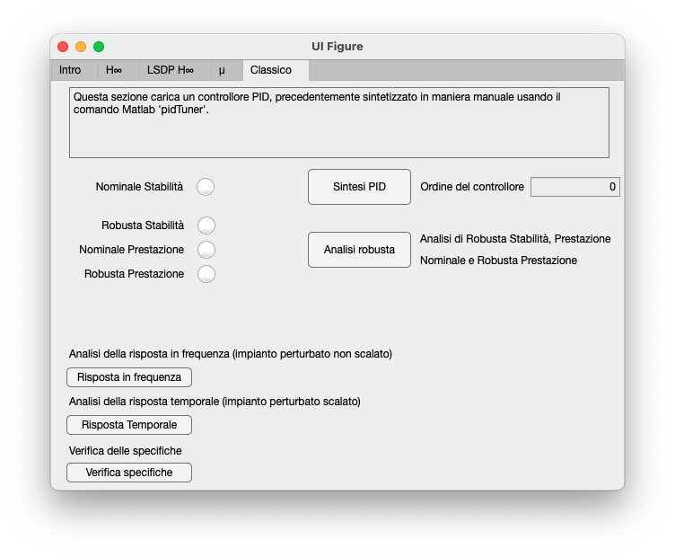

# Robust Control of a Hard Disk Drive Servo System

## Introduction

The objective of this project is to design a robust control for a servo system for hard disk drives. The hard disk drive consists of several flat disks called platters coated on both sides with a very thin layer of magnetic material. The goal of the servo-controlled system is to achieve precise positioning of the read/write heads on the desired track during data writing or reading and a fast transition from one track to another during search mode.

One of the inherent limits in designing servo systems for high-density HDDs is the influence of mechanical resonant modes of the actuator on the head positioning servo. If the actuator input contains a periodic component with a frequency equal to one of the actuator's mechanical resonance frequencies, the actuator's response can be amplified, leading to excessive head motion and, ultimately, data corruption. The controller must be designed robustly to account for these mechanical resonances.

This repository contains the code, report, and presentation of a project that reproduces a case study described in [[1]](#references-1).

## References
1. Gu, D.-W.; Petkov, P.Hr.; Konstantinov, M.M. 2013. Robust Control Design with MATLAB®, 2nd ed.. Springer-Verlag, London. ISBN: 978-1-4471-4681-0

## Objectives
* Specification of temporal and frequency requirements
* Synthesis of a μ-controller
* Synthesis of an H∞-controller
* Synthesis of an H∞ LSDP-controller
* Synthesis of a classical controller
* Synthesis of an LGQ/LTR controller
* Analysis of nominal stability, nominal performance, robust stability, and robust performance of the system with the synthesized controllers
* MATLAB® code that includes a graphical user interface (GUI) to assist users with synthesizing and analyzing any of the controllers mentioned

## GUI

